# Proyecto SQL: Análisis de Ventas Retail (Modelo MegaMart)

## 📌 Resumen (Overview)
_El área comercial de **MegaMart**, una cadena de tiendas retail, desea entender mejor el comportamiento de sus ventas, sus clientes y el desempeño de sus tiendas y productos. Sin embargo, no cuenta con una visión clara ni consolidada de esta información. Mi objetivo es utilizar **SQL** dentro de **SQL Server Management Studio**, analizando los datos de clientes, productos, tiendas y transacciones para responder preguntas de negocio clave y entregar recomendaciones accionables._

## 📩 Si quieres contactarme aqui te dejo mi linkedin =)
<p align="center">
  <a href="https://www.linkedin.com/in/sebastian-valentin-malpartida-11664428a/">
    
  </a>
</p> 


## 🔄Estructura del Proyecto

- [Sobre los Datos](#sobre-los-datos)
- [Habilidades de SQL server aplicadas](#habilidades-de-sql-server-aplicadas)
- [Creación de la Base de Datos y Tablas](#creación-de-la-base-de-datos-y-tablas)
- [Carga de Datos](#carga-de-datos)
- [Validación de los Datos](#validación-de-los-datos)
- [Tareas](#tareas)
- [Desarrollo de Tareas](#desarrollo-de-tareas)

## Sobre los Datos

El conjunto de datos ("Retail Sales Dataset", disponible en Kaggle) es un dataset simulado que representa el entorno de una tienda retail: compras de clientes distribuidas en varias tiendas y categorías de productos. Incluye 4 tablas que capturan información sobre ventas, clientes, productos y tiendas, distribuidas en 25 columnas y más de 5000 transacciones para un análisis detallado (sin contar la tabla de tiempo).

El modelo se estructura en las siguientes tablas:
* **Clientes:** Nombre, apellido, género, fecha_de_nacimiento, ciudad, fecha_de_ingreso
* **Productos:** Nombre_de_producto, categoría, subcategoría, precio_unitario, costo
* **Tiendas:** Nombre_de_tienda, ciudad, región
* **Transacciones (tabla de hechos)**: ClaveFecha, ID_de_cliente, ID_de_producto, ID_de_tienda, cantidad, descuento, método_de_pago

Adicionalmente, tal como se mencionó anteriormente, se agregó una nueva tabla dimensional para el manejo de fechas mediante Lenguaje M de Excel, la cual contiene:

* **Tiempo**: ClaveFecha, Año, NúmeroMes, Mes, Trimestre, AñoTrimestre, AñoMes, NúmeroDíaSemana, DíaSemana, NúmeroDíaMes, EsFinDeSemana, NúmeroSemana

Para encontrar mucha más información sobre la base de datos original la puedes encontrar [aquí](https://www.kaggle.com/datasets/buharishehu/retail-sales-dataset/data).

El modelo cuenta con una estructura en estrella, estableciendo relaciones de uno a muchos entre la tabla de hechos y las cuatro tablas dimensionales para un análisis más directo y eficiente.


## 🎓 Habilidades de SQL server aplicadas
- Comandos basicos
- Agregaciones
- Joins
- Subconsultas
- Funciones de ventana
    - over ()
    - over (partition by )
- Getdate ()
- Datediff
- Case when 

## Creación de la Base de Datos y Tablas

Se creó la base de datos `RETAIL_SALES` en SQL Server Management Studio, junto con las 4 tablas dimensionales (`DIM_CLIENTES`, `DIM_PRODUCTOS`, `DIM_TIENDAS`, `DIM_TIEMPO`) y la tabla de hechos (`FACT_TRANSAC`), relacionadas mediante llaves foráneas siguiendo el esquema en estrella.

Justo después de `USE`, se configura `SET DATEFORMAT dmy` para que SQL Server interprete las fechas en formato peruano (día/mes/año) al momento de la carga; sin esto, el `BULK INSERT` falla con errores de conversión en columnas `date`.

Antes de cada `CREATE TABLE` se valida con `OBJECT_ID` si la tabla ya existe, para eliminarla y evitar conflictos al volver a ejecutar el script.


```sql
CREATE DATABASE RETAIL_SALES;
USE RETAIL_SALES;

-- Convierte el formato de fecha de Perú (dd/mm/yyyy) al que espera SQL Server.
-- Debe ejecutarse una sola vez, antes de cualquier carga de datos.
SET DATEFORMAT dmy;

-- ============================================
-- TABLA DIMENSIÓN: DIM_CLIENTES
-- ============================================

IF OBJECT_ID('DIM_CLIENTES') IS NOT NULL
    DROP TABLE DIM_CLIENTES;

CREATE TABLE DIM_CLIENTES ( 
    IDCliente Nvarchar(150) PRIMARY KEY,
    Nombre Nvarchar(150),
    Apellido Nvarchar(150),
    Genero Nvarchar(150),
    FechaNacimiento date,
    Ciudad Nvarchar(150),
    FechaRegistro date
);

-- ============================================
-- TABLA DIMENSIÓN: DIM_PRODUCTOS
-- ============================================

IF OBJECT_ID('DIM_PRODUCTOS') IS NOT NULL
    DROP TABLE DIM_PRODUCTOS;

CREATE TABLE DIM_PRODUCTOS ( 
    IDProducto Nvarchar(150) PRIMARY KEY,
    NombreProducto Nvarchar(150),
    Categoria Nvarchar(150),
    SubCategoria Nvarchar(150),
    PrecioUnitario float,
    PrecioCosto float
);

-- ============================================
-- TABLA DIMENSIÓN: DIM_TIENDAS 
-- ============================================

IF OBJECT_ID('DIM_TIENDAS') IS NOT NULL
    DROP TABLE DIM_TIENDAS;

CREATE TABLE DIM_TIENDAS ( 
    IDTienda Nvarchar(150) PRIMARY KEY,
    NombreTienda Nvarchar(150),
    Ciudad Nvarchar(150),
    Region Nvarchar(150)
);

-- ============================================
-- TABLA DIMENSIÓN: DIM_TIEMPO 
-- ============================================

IF OBJECT_ID('DIM_TIEMPO') IS NOT NULL
    DROP TABLE DIM_TIEMPO;

CREATE TABLE DIM_TIEMPO ( 
    ClaveFecha Date PRIMARY KEY,
    Año Nvarchar(150),
    NumeroMes int,
    Mes Nvarchar(150),
    Trimestre Nvarchar(150),
    AñoTrimestre Nvarchar(150),
    AñoMes Nvarchar(150),
    NumeroDiaSemana int,
    DiaSemana Nvarchar(150),
    NumeroDiaMes int,
    EsFinDeSemana Nvarchar(150),
    NumeroSemana int
);

-- ============================================
-- TABLA DE HECHOS: FACT_TRANSAC
-- ============================================

IF OBJECT_ID('FACT_TRANSAC') IS NOT NULL
    DROP TABLE FACT_TRANSAC;

CREATE TABLE FACT_TRANSAC ( 
    IDTransaccion Nvarchar(150) PRIMARY KEY,
    ClaveFecha date,
    IDCliente Nvarchar(150),
    IDProducto Nvarchar(150),
    IDTienda Nvarchar(150),
    Cantidad int,
    Descuento float,
    MetodoPago Nvarchar(150),
    CONSTRAINT FK_Fact_Cliente  FOREIGN KEY (IDCliente)  REFERENCES DIM_CLIENTES(IDCliente),
    CONSTRAINT FK_Fact_Producto FOREIGN KEY (IDProducto) REFERENCES DIM_PRODUCTOS(IDProducto),
    CONSTRAINT FK_Fact_Tienda   FOREIGN KEY (IDTienda)   REFERENCES DIM_TIENDAS(IDTienda),
    CONSTRAINT FK_Fact_Fecha    FOREIGN KEY (ClaveFecha) REFERENCES DIM_TIEMPO(ClaveFecha)
);
```

## Carga de Datos

Los datos se cargaron desde archivos CSV usando `BULK INSERT`, con `;` como delimitador de campo y omitiendo la fila de encabezado (`FIRSTROW = 2`). El `SET DATEFORMAT dmy` ejecutado en la sección anterior aplica a toda la sesión, por lo que no es necesario repetirlo antes de cada carga. 
Importante, si pienzas usar estos datos debes saber en que parte de tu escritorio lo guardas para poder el remplazar la dirección de este codigo por el tuyo.
En la carpeta `Data` estare dejando los archivos csv.

```sql
-- Clientes
BULK INSERT DIM_CLIENTES
FROM 'D:\CURSO DE SQL-General\TF_SQL_2026\Trabajo_Final_SQL\Data\Dim_Clientes.csv' 
WITH (
    FORMAT = 'CSV',
    FIRSTROW = 2,
    FIELDTERMINATOR = ';',
    ROWTERMINATOR = '\n'
);

-- Productos
BULK INSERT DIM_PRODUCTOS
FROM 'D:\CURSO DE SQL-General\TF_SQL_2026\Trabajo_Final_SQL\Data\Dim_Productos.csv' 
WITH (
    FORMAT = 'CSV',
    FIRSTROW = 2,
    FIELDTERMINATOR = ';',
    ROWTERMINATOR = '\n'
);

-- Tiendas
BULK INSERT DIM_TIENDAS
FROM 'D:\CURSO DE SQL-General\TF_SQL_2026\Trabajo_Final_SQL\Data\Dim_Tiendas.csv' 
WITH (
    FORMAT = 'CSV',
    FIRSTROW = 2,
    FIELDTERMINATOR = ';',
    ROWTERMINATOR = '\n'
);

-- Tiempo
BULK INSERT DIM_TIEMPO
FROM 'D:\CURSO DE SQL-General\TF_SQL_2026\Trabajo_Final_SQL\Data\Dim_Tiempo.csv' 
WITH (
    FORMAT = 'CSV',
    FIRSTROW = 2,
    FIELDTERMINATOR = ';',
    ROWTERMINATOR = '\n'
);

-- Transacciones (tabla de hechos)
BULK INSERT FACT_TRANSAC
FROM 'D:\CURSO DE SQL-General\TF_SQL_2026\Trabajo_Final_SQL\Data\Fact_Transacciones.csv' 
WITH (
    FORMAT = 'CSV',
    FIRSTROW = 2,
    FIELDTERMINATOR = ';',
    ROWTERMINATOR = '\n'
);
```

Tras cada carga se verificó el resultado con `SELECT * FROM <tabla>` para confirmar que los datos ingresaron correctamente.


## Validación de los Datos

#### Valores Nulos o Faltantes

Se verificó la existencia de valores faltantes en los campos clave de las tablas dimensionales y de hechos. No se encontraron valores nulos (las llaves primarias ya lo impiden por diseño, pero se documenta como parte del proceso de validación).

```sql
-- Verificar valores faltantes en DIM_CLIENTES --
SELECT COUNT(*) AS Numero_De_Nulls
FROM DIM_CLIENTES
WHERE IDCliente IS NULL;

-- Verificar valores faltantes en DIM_PRODUCTOS --
SELECT COUNT(*) AS Numero_De_Nulls
FROM DIM_PRODUCTOS
WHERE IDProducto IS NULL;

-- Verificar valores faltantes en DIM_TIENDAS --
SELECT COUNT(*) AS Numero_De_Nulls
FROM DIM_TIENDAS
WHERE IDTienda IS NULL;

-- Verificar valores faltantes en FACT_TRANSAC --
SELECT COUNT(*) AS Numero_De_Nulls
FROM FACT_TRANSAC
WHERE IDTransaccion IS NULL
    OR IDCliente IS NULL
    OR IDProducto IS NULL
    OR IDTienda IS NULL;
```

A continuación, se verificó que no existan filas duplicadas en el campo clave osea la el IDTransaccion de la tabla FACT_TRANSAC. No se encontraron duplicados ya que segun el CSV debe tener 5000 IDTransaccion distintos

```sql
-- Verificar valores duplicados en FACT_TRANSAC --
with TB_Duplicados as (
	SELECT  IDTransaccion, COUNT(*) AS Total_ID
	from FACT_TRANSAC
	GROUP BY IDTransaccion
	having COUNT(*) = 1 
	)
select sum(Total_ID) as Total_Valores_Unicos
from TB_Duplicados
```


## Tareas

En este análisis, ayudo al área comercial de MegaMart a responder lo siguiente:

1. ¿Con qué surtido estamos trabajando realmente? Necesito saber cuántos productos tengo por categoría, y en qué rango de precios se mueve cada una, porque estamos discutiendo si el catálogo está desbalanceado hacia Electronics.

2. ¿En qué ciudades se concentra mi base de clientes? Quiero enfocar el presupuesto de marketing local solo en ciudades con masa crítica, así que muéstrame únicamente las que tengan más de 2 clientes registrados.

3. Estamos renegociando comisiones con el banco adquirente. Necesito el peso de cada método de pago en número de transacciones y en unidades vendidas para entrar a esa reunión con cifras.

4. Autorizamos descuentos de 0%, 5%, 10% y 15%, pero no sé con qué frecuencia se aplican. Quiero ver cuántas operaciones y cuántas unidades salen con cada nivel, y qué porcentaje del total representa el descuento máximo. 

5. Antes de armar la campaña del próximo trimestre, quiero los 10 productos que más dinero dejan por unidad vendida (precio menos costo), sin importar todavía cuánto rotan.
6. Esta es la tabla que abre el comité. Necesito venta neta y margen bruto por tienda y región en todo el histórico, para decidir dónde reforzamos dotación y dónde revisamos el modelo de operación.

7. ¿Dónde está el valor por operación? Quiero comparar el ticket promedio y las unidades por transacción entre categorías y subcategorías, porque sospecho que Groceries genera mucho volumen pero poco valor. 

8. Voy a rediseñar la comunicación por segmento. Necesito agrupar a los clientes en rangos de edad (menos de 30, 30 a 44, 45 a 59, 60 o más) calculados a la fecha de hoy, y ver cuánto compra cada segmento por género.

9. Quiero definir los turnos y las promociones por día. Muéstrame la venta neta por mes calendario y, dentro de cada mes, cuánto pesa el fin de semana frente a los días de semana.

10. Necesito saber qué productos del catálogo nunca se vendieron y qué clientes registrados nunca compraron. Eso define qué descontinuamos y a quién metemos en campaña de activación.

11. Para la negociación con proveedores necesito los 3 productos líderes de cada categoría por venta neta, y qué porcentaje de la venta de su categoría representa cada uno. Quiero saber qué tan dependientes somos de pocos SKU.

12. Quiero la serie mensual de venta neta con la variación respecto al mes anterior y el acumulado del año en curso. Es el gráfico que llevo a directorio cada mes.

13. Tengo dos años completos de historia. Compárame el periodo sep-2023 a ago-2024 contra sep-2024 a ago-2025 por región y categoría, y dime dónde crecimos y dónde retrocedimos.

14. Quiero un tablero de clientes que combine cuánto hace que no compran, cuántas veces compraron y cuánto gastaron, clasificados en Activo, En riesgo y Dormido, y divididos en cuartiles de gasto. Con eso armo la campaña de retención del trimestre.

15. Necesito saber si los clientes que captamos en 2024 valen más o menos que los de 2023. Agrúpalos por el mes en que se registraron y muéstrame cuántos llegaron a comprar, cuánto tardaron en hacer su primera compra y cuánto gastan en promedio.

## Desarrollo de Tareas

1. ¿Con qué surtido estamos trabajando realmente? Necesito saber cuántos productos tengo por categoría y subcategoría, y en qué rango de precios se mueve cada una, porque estamos discutiendo si el catálogo está desbalanceado hacia Electronics.

```sql
SELECT Categoria,
		count(*) as Total_Productos,
		Max(PrecioUnitario) as PrecioMaximo,
		Avg(PrecioUnitario) as PrecioPromedio,
		Min(PrecioUnitario) as PrecioMinimo,
		100 *count(*) / sum(count(*)) over () as PorcentajeTotal 
FROM DIM_PRODUCTOS
GROUP BY Categoria
ORDER BY Categoria ASC
```
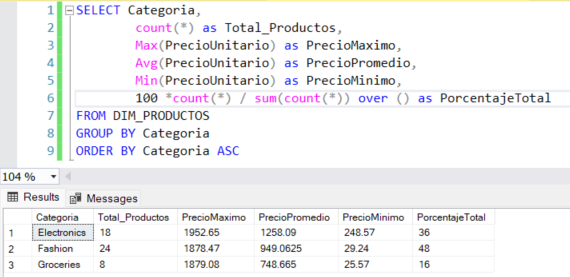

Fashion concentra el 48% de los productos (24 SKU), Electronics el 36% (18) y Groceries solo el 16% (8). El catálogo sí está desbalanceado, pero hacia Fashion, no hacia Electronics como se pensaba.

----------------------------------------------------------------------------------------
2. ¿En qué ciudades se concentra el volumen de ventas de mi negocio? Quiero enfocar el presupuesto de marketing local solo en ciudades con masa crítica de actividad comercial, así que muéstrame únicamente las que registren más de 30 ventas (transacciones).

```sql
SELECT DC.Ciudad,
		COUNT(DC.IDCliente) AS TOTAL_VENTAS
FROM FACT_TRANSAC FT
INNER JOIN DIM_CLIENTES DC ON FT.IDCliente = DC.IDCliente
GROUP BY DC.Ciudad 
HAVING COUNT(DC.IDCliente) > 30
``` 
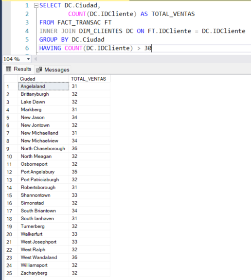

Solo 25 de las 200 ciudades superan las 30 transacciones, con un máximo de 36. Cada ciudad tiene un solo cliente, así que este conteo mide la frecuencia de compra individual y no concentración geográfica.

------------------------------------------------------------------------------------------
3. Estamos renegociando comisiones con el banco adquirente. Necesito el peso de cada método de pago en número de transacciones y en unidades vendidas para entrar a esa reunión con cifras.

```sql
SELECT MetodoPago,
       COUNT(IDTransaccion) AS Total_Transacciones,
       SUM(Cantidad) AS Total_Cantidad_Vendida,
       ROUND(100.0 * COUNT(IDTransaccion) / SUM(COUNT(IDTransaccion)) OVER(), 2) AS Peso_Transacciones_Percent,
       ROUND(100.0 * SUM(Cantidad) / SUM(SUM(Cantidad)) OVER(), 2) AS Peso_Cantidad_Percent
FROM FACT_TRANSAC
GROUP BY MetodoPago
ORDER BY Total_Transacciones DESC;
```
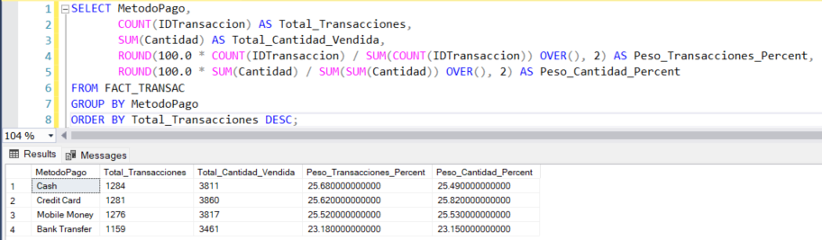

Los cuatro métodos de pago están empatados: Cash 25.68%, Credit Card 25.62%, Mobile Money 25.52% y Bank Transfer 23.18%. Al no depender de ningún medio en particular, la cadena tiene margen para negociar comisiones.

------------------------------------------------------------------------------------------
4. Autorizamos descuentos de 0%, 5%, 10% y 15%, pero no sé con qué frecuencia se aplican. Quiero ver cuántas operaciones y cuántas unidades salen con cada nivel, y qué porcentaje del total representa el descuento máximo. 

```sql
SELECT Descuento,
		COUNT(IDTransaccion) AS NumeroTransaccione ,
		SUM(Cantidad) AS TotalCantidad,
		CAST(ROUND(100.0 * COUNT(IDTransaccion) / SUM(COUNT(IDTransaccion)) OVER(), 2) AS decimal(10,2)) AS Peso_NumTransac_Percent,
        CAST(ROUND(100.0 * SUM(Cantidad) / SUM(SUM(Cantidad)) OVER(), 2) AS decimal(10,2)) AS Peso_TotalCantidad_Percent
FROM FACT_TRANSAC
GROUP BY Descuento
order by Descuento desc
```
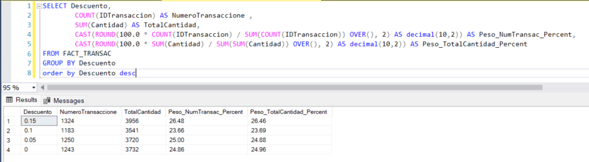

El descuento del 15% es el más aplicado de todos, con 26.48% de las operaciones. Solo una de cada cuatro ventas se hace a precio de lista, lo que indica que el descuento máximo se convirtió en la norma y no en la excepción.

-----------------------------------------------------------------------------------------

5. Antes de armar la campaña del próximo trimestre, quiero comparar cuánto deja cada producto por unidad vendida en dos escenarios: precio de lista (sin descuento) versus el precio real que se cobró en cada transacción (con descuento). Dame los 10 productos con mayor utilidad promedio real, mostrando ambas cifras lado a lado para ver cuánto se pierde por los descuentos aplicados.

```sql
-- Sin descuento
SELECT Distinct TOP 10
		NombreProducto,
		(PrecioUnitario - PrecioCosto) as Utilida_por_Unidad
FROM DIM_PRODUCTOS
order by Utilida_por_Unidad DESC
```
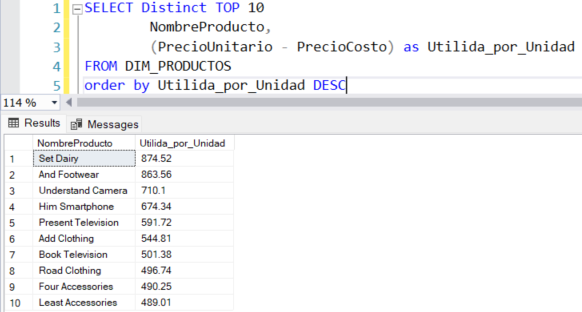
..................................................................................

```sql
-- Con descuento
with TB_Utilidad_Promedio as (
	SELECT  DP.NombreProducto,
			round(AVG(((DP.PrecioUnitario * (1.0-Ft.Descuento)) - DP.PrecioCosto)) over (partition by NombreProducto), 2) as Promedio_Utilidad_NombreProducto
	FROM FACT_TRANSAC FT 
	INNER JOIN DIM_PRODUCTOS DP ON FT.IDProducto = DP.IDProducto
	)
select top 10 NombreProducto , Promedio_Utilidad_NombreProducto
from TB_Utilidad_Promedio
GROUP BY NombreProducto, Promedio_Utilidad_NombreProducto
ORDER BY Promedio_Utilidad_NombreProducto desc
```
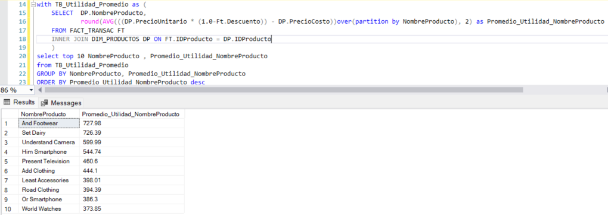

Set Dairy lidera a precio de lista (874.52) pero cae al segundo lugar en utilidad real (726.39) por efecto del descuento. La pérdida por descuentos va de 15.5% a 22.2%, siendo Present Television el producto más castigado.

------------------------------------------------------------------------------------------
6. Esta es la tabla que abre el comité. Necesito venta neta y margen bruto por tienda y región en todo el histórico, para decidir dónde reforzamos dotación y dónde revisamos el modelo de operación.

```sql
SELECT NombreTienda,
		Region, 
		SUM(Venta_Neta_Transac) as Venta_Total,
		SUM(Utilidad_Bruta_Tienda) as Utilidad_Total,
		round(SUM(Utilidad_Bruta_Tienda) / SUM(Venta_Neta_Transac), 3) as Margen_Bruto_Utilidad
FROM (SELECT DT.NombreTienda,
			DT.Region,
			FT.Cantidad,
			FT.Descuento,
			DP.PrecioUnitario,
			DP.PrecioCosto,
			(FT.Cantidad * DP.PrecioUnitario * (1.0 - FT.Descuento)) AS Venta_Neta_Transac,
			((((1.0-FT.Descuento)*DP.PrecioUnitario) - DP.PrecioCosto)*FT.Cantidad) as Utilidad_Bruta_Tienda
	from FACT_TRANSAC FT 
	INNER JOIN DIM_TIENDAS DT ON  FT.IDTienda = DT.IDTienda
	INNER JOIN DIM_PRODUCTOS DP ON DP.IDProducto = FT.IDProducto) AS TB_TIENDA_VENTA
GROUP BY NombreTienda, Region
ORDER BY Margen_Bruto_Utilidad DESC
```
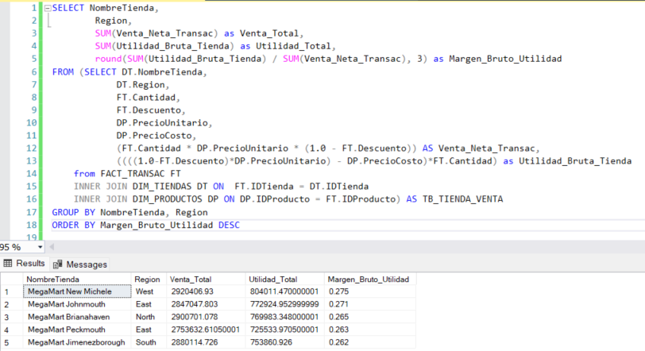

Las cinco tiendas tienen márgenes casi iguales, entre 26.2% y 27.5%. New Michele lidera en venta y margen, mientras Peckmouth queda última en ambos con una brecha de 6% frente al líder.

--------------------------------------------------------------------------------------

7. ¿Dónde está el valor por operación? Quiero comparar el ticket promedio y las unidades por transacción entre categorías y subcategorías, porque sospecho que Groceries genera mucho volumen pero poco valor. 

```sql
SELECT DP.Categoria,
       DP.SubCategoria,
       COUNT(FT.IDTransaccion) as Total_Transacciones,
       SUM(FT.Cantidad) as Total_Unidades,
       ROUND(AVG(FT.Cantidad * DP.PrecioUnitario * (1.0 - FT.Descuento)), 2) as Ticket_Promedio,
       ROUND(AVG(CAST(FT.Cantidad as FLOAT)), 2) as Unidades_Por_Transaccion
FROM FACT_TRANSAC FT
INNER JOIN DIM_PRODUCTOS DP ON FT.IDProducto = DP.IDProducto
GROUP BY DP.Categoria, DP.SubCategoria
ORDER BY DP.Categoria, Ticket_Promedio DESC;
```
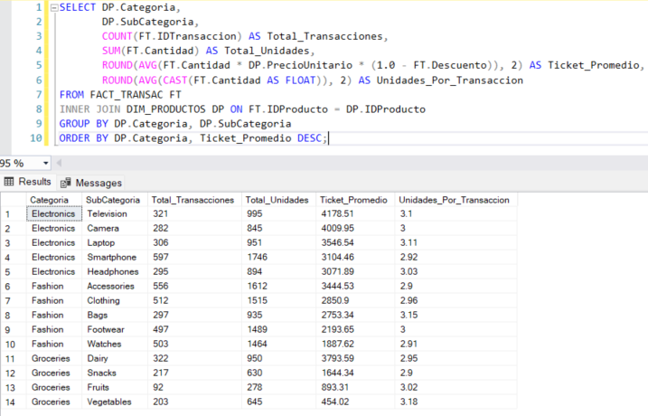

Los tickets más altos están en Television (4,179) y Camera (4,010), y Dairy sorprende en tercer lugar (3,794). Las unidades por transacción son planas en todas las subcategorías (2.90 a 3.18), así que las diferencias de ticket vienen del precio del producto y no de que la gente compre más cantidad.

------------------------------------------------------------------------------------------

8. Voy a rediseñar la comunicación por segmento. Necesito agrupar a los clientes en rangos de edad (menos de 30, 30 a 44, 45 a 59, 60 o más) calculados a la fecha de hoy, y ver cuánto compra cada segmento por género.

```sql
WITH TB_EDAD as (
    SELECT IDCliente,
           Genero,
           DATEDIFF(YEAR, FechaNacimiento, GETDATE())
             - CASE 
					WHEN (MONTH(FechaNacimiento) > MONTH(GETDATE())) OR (MONTH(FechaNacimiento) = MONTH(GETDATE()) AND DAY(FechaNacimiento) > DAY(GETDATE()))
						THEN 1 
					ELSE 0 END as Edad
    FROM DIM_CLIENTES
),
TB_SEGMENTO as (
    SELECT IDCliente,
           Genero,
           CASE
               WHEN Edad < 30 THEN 'Menos de 30'
               WHEN Edad BETWEEN 30 AND 44 THEN '30 a 44'
               WHEN Edad BETWEEN 45 AND 59 THEN '45 a 59'
               ELSE '60 o más'
           END as SegmentoEdad
    FROM TB_EDAD
)
SELECT TS.SegmentoEdad,
       TS.Genero,
       COUNT(DISTINCT TS.IDCliente) as Total_Clientes,
       ROUND(SUM(FT.Cantidad * DP.PrecioUnitario * (1.0 - FT.Descuento)), 2) as Venta_Neta_Total
FROM TB_SEGMENTO TS
INNER JOIN FACT_TRANSAC FT ON FT.IDCliente = TS.IDCliente
INNER JOIN DIM_PRODUCTOS DP ON DP.IDProducto = FT.IDProducto
GROUP BY TS.SegmentoEdad, TS.Genero
ORDER BY CASE TS.SegmentoEdad
             WHEN 'Menos de 30' THEN 1
             WHEN '30 a 44' THEN 2
             WHEN '45 a 59' THEN 3
             ELSE 4
         END,
         TS.Genero;
```
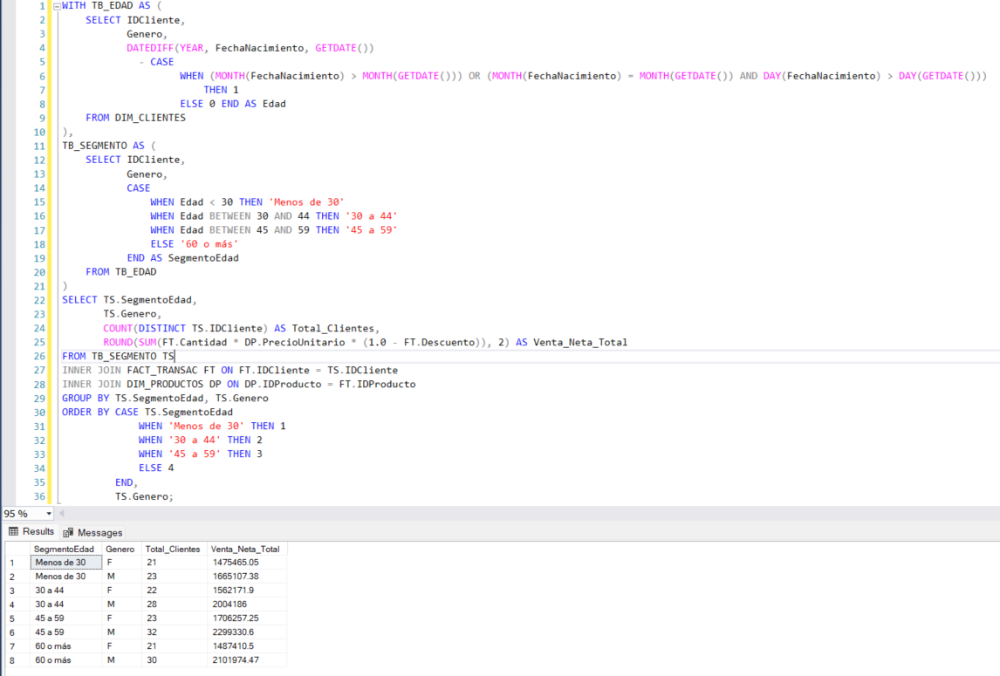

La venta por cliente es casi idéntica en todos los segmentos, entre 70,066 y 74,185. Las diferencias de venta total se explican por cuántos clientes tiene cada grupo, no por cuánto compra cada uno, así que edad y género no sirven para segmentar.

9. Quiero definir los turnos y las promociones por día. Muéstrame la venta neta por mes calendario y, dentro de cada mes, cuánto pesa el fin de semana frente a los días de semana, usando la información de la dimensión de tiempo del modelo.

```sql
WITH TB_BASE as (
    SELECT
        DT.AñoMes,
        DT.EsFinDeSemana,
        FT.Cantidad * DP.PrecioUnitario * (1.0 - FT.Descuento) as VentaNeta
    FROM FACT_TRANSAC FT
    INNER JOIN DIM_PRODUCTOS DP ON DP.IDProducto = FT.IDProducto
    INNER JOIN DIM_TIEMPO DT ON DT.ClaveFecha = FT.ClaveFecha
)
SELECT AñoMes,
       CASE 
			WHEN EsFinDeSemana = 'VERDADERO' 
				THEN 'Fin de Semana' 
			ELSE 'Entre Semana' 
				END AS TipoDia,
       ROUND(SUM(VentaNeta), 2) as Venta_Neta,
       ROUND(100.0 * SUM(VentaNeta) / SUM(SUM(VentaNeta)) OVER (PARTITION BY AñoMes), 2) as Peso_Dentro_Mes_Percent
FROM TB_BASE
GROUP BY AñoMes, EsFinDeSemana
ORDER BY AñoMes, TipoDia;
```
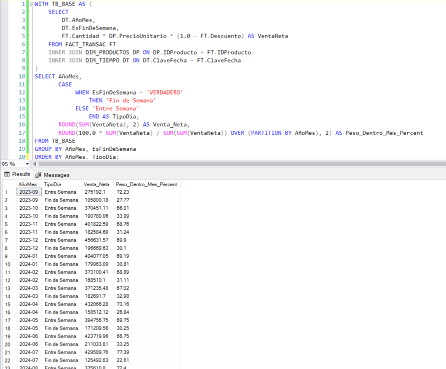

El fin de semana aporta 28.7% de la venta y representa 28.6% de los días del periodo. Vende exactamente lo que le corresponde por cantidad de días, así que no existe efecto fin de semana.

10. ¿De dónde sale realmente mi facturación? Quiero saber cuánto pesan las compras chicas frente a las grandes, para decidir si la prioridad es aumentar el ticket o traer más gente.

```sql
SELECT
    CASE
        WHEN FT.Cantidad <= 2 THEN 'Compra chica (1-2 und)'
        WHEN FT.Cantidad =  3 THEN 'Compra media (3 und)'
        ELSE 'Compra grande (4-5 und)'
    END AS TamanoCompra,
    COUNT(*) as TotalTransacciones,
    SUM(FT.Cantidad) as UnidadesVendidas,
    ROUND(SUM(FT.Cantidad * DP.PrecioUnitario * (1 - FT.Descuento)), 2) as VentaNeta,
    ROUND(SUM(FT.Cantidad * DP.PrecioUnitario * (1 - FT.Descuento)) / COUNT(*), 2) as TicketPromedio,
    ROUND(100.0 * COUNT(*) / SUM(COUNT(*)) OVER (), 1) as PctTransacciones,
    ROUND(100.0 * SUM(FT.Cantidad * DP.PrecioUnitario * (1 - FT.Descuento)) / SUM(SUM(FT.Cantidad * DP.PrecioUnitario * (1 - FT.Descuento))) OVER (), 1) as PctVenta
FROM FACT_TRANSAC FT
INNER JOIN DIM_PRODUCTOS DP ON FT.IDProducto = DP.IDProducto
GROUP BY
    CASE
        WHEN FT.Cantidad <= 2 THEN 'Compra chica (1-2 und)'
        WHEN FT.Cantidad =  3 THEN 'Compra media (3 und)'
        ELSE 'Compra grande (4-5 und)'
    END
ORDER BY VentaNeta DESC;
```
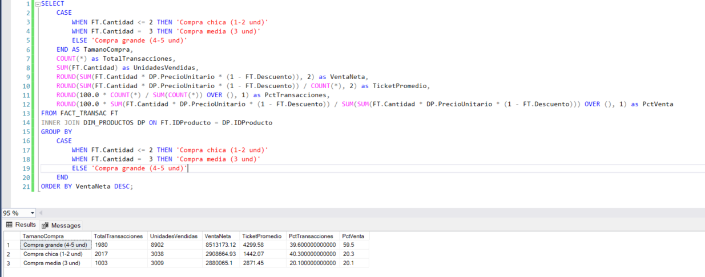

Las compras de 4 a 5 unidades son el 39.6% de las transacciones pero generan el 59.5% de la venta. La prioridad debe ser aumentar el tamaño de compra mediante venta cruzada, no traer más clientes.


